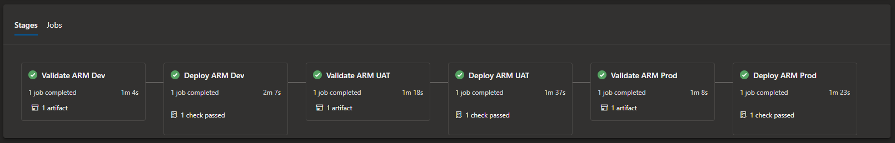
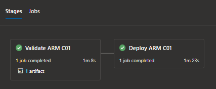

# ARM Templates with Azure Pipelines 
This Repository can be used as a starter pack for deploying resources in Azure using ARM Templates & Azure Pipelines.

## Contents: 
[/webAppLinux](https://github.com/jfe7/azure-pipelines-arm/tree/main/webAppLinux/) - Deploys a Linux Web App across multiple environments using a multi stage YAML Pipeline & ARM Parameter Files. 

 
 
[/webAppWindows](https://github.com/jfe7/azure-pipelines-arm/tree/main/webAppWindows/) - Deploys a Windows Web App using a multi stage YAML Pipeline & Parameters set from users at  Pipeline runtime. Best used when deployments are similar, but not part of the same lifecycle, for example, deploying a WebApp for different customers.

## Purpose
- Deploy Resources Accross Multiple Environments in Azure When Required.
- Reduce Human Error When Deploying Across Multiple Environments.
- Quickly Deploy Templates by Specifying Parameters at Runtime.
- Reduce Code Repetition.
- Deployment Traceability.
